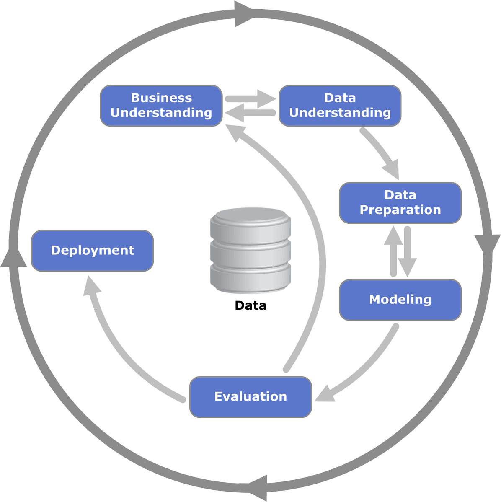
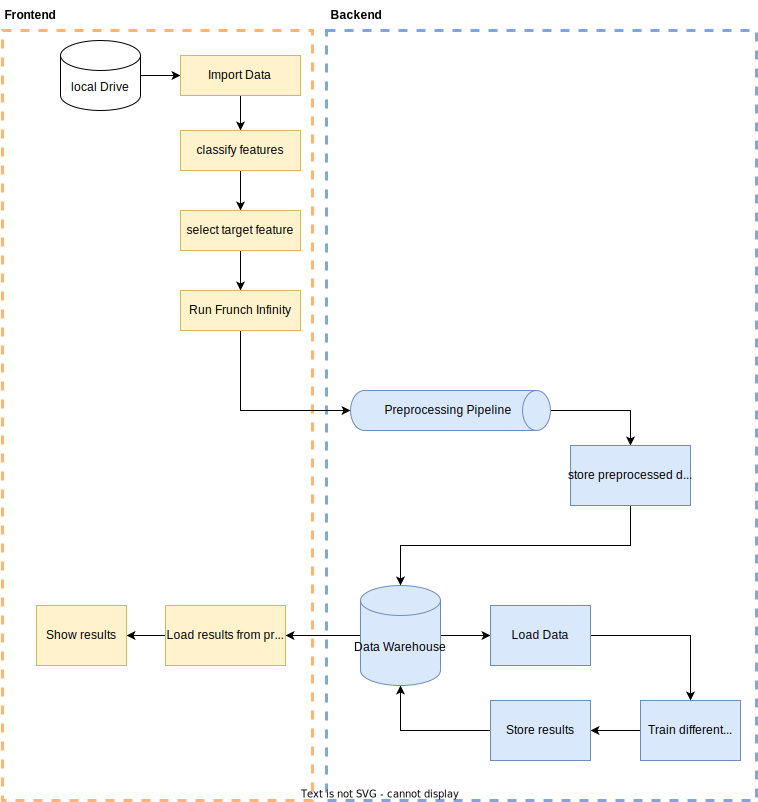

# Data Science Methodik-Konzept
Folgende Requirements wurden nach den SOPHISTEN Regeln für Frunch Infinity 2.0 definiert.

## CRISP-DM
Als Data-Science Konzept kann hier CRISP-DM angewendet werden (siehe Abbildung). Da Frunch-Infinity jedoch eine Auto-ML Lösung darstellt, ist der Business Understanding Teil nicht prioritär. Der Data Understanding Teil bleibt bei Frunch Infinity 2.0 auf der User Seite, da dieser über das UI entsprechend die Features sowie die Zielvariable im Datensatz definieren muss. Außerdem soll der User durch die Anwendung von Frunch-Infinity 2.0 einen Einblick in die Qualität der verwendeten Daten kriegen und somit das Verständnis der Daten gewährleisten. Am meisten Entwicklungsaufwand findet im Data Preprocessing Teil, da die Pipeline so flexibel gestaltet werden muss, um das System für unterschiedliche Datensätze auslegen zu können. 

## Konzept Datenfluss:
Die nachfolgende Grafik zeigt eine Übersicht des Datenflusses. Dabei stellen die gelb markierten Blöcke das Frontend und die blau markierten Blöcke das Backend dar.

